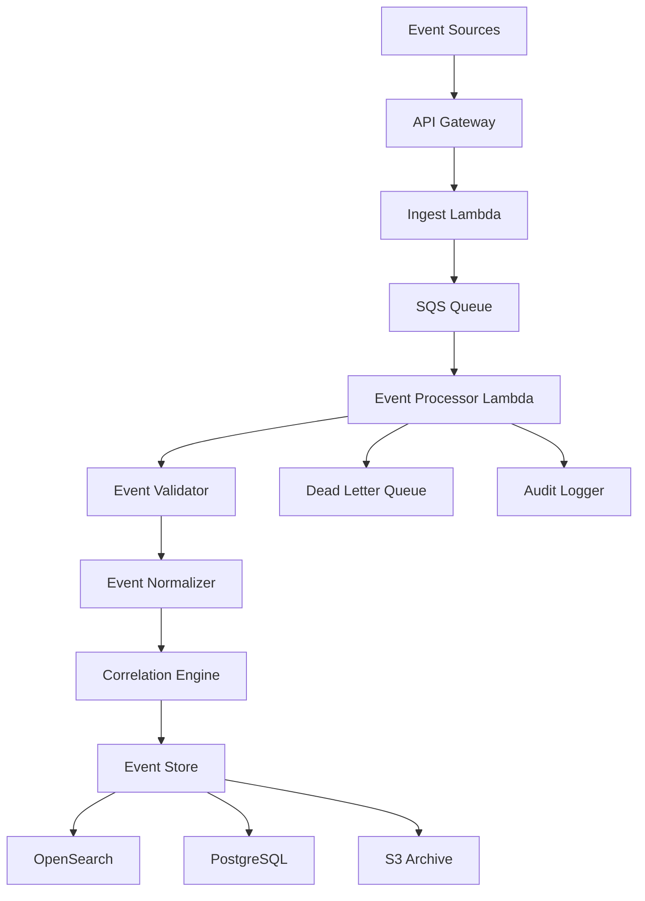

# Design Document: Activity Event Processing

## Overview

The Activity Event Processing system provides the foundational event model for the entire Betalogs platform. It implements a canonical event structure that unifies business, system, delivery, and security events while maintaining strict tenant isolation and supporting efficient correlation for story reconstruction. The design emphasizes high-throughput ingestion, consistent validation, and optimized storage for both real-time and analytical queries.

## Architecture

The activity event processing follows an event-driven pipeline architecture:



The pipeline separates ingestion from processing to handle traffic spikes, with validation, normalization, and correlation happening in the processing stage before storage across multiple systems optimized for different access patterns.

## Components and Interfaces

### Event Ingest Controller

**Responsibility**: HTTP event ingestion, initial validation, queue routing
**Interface**:

```typescript
interface EventIngestController {
  ingestEvent(request: EventIngestRequest): Promise<EventIngestResponse>;
  ingestBatch(request: BatchEventRequest): Promise<BatchEventResponse>;
}

interface EventIngestRequest {
  event: RawEvent;
  tenantId: string; // from auth context
  source: string;
}

interface RawEvent {
  timestamp: string;
  category: "business" | "system" | "delivery" | "security";
  action: string;
  actor?: Record<string, any>;
  object?: Record<string, any>;
  correlation?: Record<string, any>;
  outcome?: Record<string, any>;
  evidence?: Record<string, any>;
  metadata?: Record<string, any>;
}
```

### Event Processor

**Responsibility**: Core event processing, validation, normalization, correlation
**Interface**:

```typescript
interface EventProcessor {
  processEvent(
    rawEvent: RawEvent,
    context: ProcessingContext
  ): Promise<ProcessedEvent>;
  validateEvent(event: RawEvent): Promise<ValidationResult>;
  normalizeEvent(event: RawEvent): Promise<CanonicalEvent>;
  extractCorrelation(event: CanonicalEvent): Promise<CorrelationData>;
}

interface ProcessingContext {
  tenantId: string;
  eventId: string;
  processingTimestamp: Date;
  source: string;
}

interface ValidationResult {
  isValid: boolean;
  errors: ValidationError[];
  warnings: ValidationWarning[];
}
```

### Canonical Event Model

**Responsibility**: Unified event structure across all categories
**Interface**:

```typescript
interface CanonicalEvent {
  // Core identification
  eventId: string;
  tenantId: string;
  timestamp: Date;
  processingTimestamp: Date;

  // Event classification
  category: EventCategory;
  action: string;

  // Actor information (who)
  actor: {
    userId?: string;
    email_hash?: string;
    serviceName?: string;
    role?: string;
  };

  // Object information (what)
  object: {
    orderId?: string;
    requestId?: string;
    sessionId?: string;
    ticketId?: string;
    resourceId?: string;
  };

  // Correlation data (linking)
  correlation: {
    traceId?: string;
    spanId?: string;
    correlationId?: string;
    parentEventId?: string;
  };

  // Outcome information (result)
  outcome: {
    status: "success" | "failure" | "pending";
    error_class?: string;
    error_code?: string;
    message?: string;
  };

  // Evidence links (supporting data)
  evidence: {
    github?: {
      commitSha?: string;
      pr?: string;
      repository?: string;
    };
    raw_s3_pointer?: string;
    trace_url?: string;
    log_references?: string[];
  };

  // Context metadata
  context: {
    environment: string;
    service?: string;
    endpoint?: string;
    version?: string;
  };
}

type EventCategory = "business" | "system" | "delivery" | "security";
```

### Event Store

**Responsibility**: Multi-storage persistence with optimized access patterns
**Interface**:

```typescript
interface EventStore {
  storeEvent(event: CanonicalEvent): Promise<StorageResult>;
  storeBatch(events: CanonicalEvent[]): Promise<BatchStorageResult>;
  queryEvents(query: EventQuery): Promise<EventQueryResult>;
  getEventById(
    eventId: string,
    tenantId: string
  ): Promise<CanonicalEvent | null>;
}

interface EventQuery {
  tenantId: string;
  timeRange?: { from: Date; to: Date };
  categories?: EventCategory[];
  correlationIds?: Record<string, string>;
  filters?: EventFilters;
  pagination?: PaginationOptions;
}

interface EventFilters {
  actor?: Record<string, string>;
  object?: Record<string, string>;
  outcome?: { status?: string; error_class?: string };
  context?: { environment?: string; service?: string };
}
```

### Correlation Engine

**Responsibility**: Event linking and correlation metadata extraction
**Interface**:

```typescript
interface CorrelationEngine {
  extractCorrelationData(event: CanonicalEvent): Promise<CorrelationData>;
  linkEvents(events: CanonicalEvent[]): Promise<EventLinkage[]>;
  findRelatedEvents(
    correlationData: CorrelationData,
    tenantId: string
  ): Promise<CanonicalEvent[]>;
}

interface CorrelationData {
  primary: {
    traceId?: string;
    requestId?: string;
    orderId?: string;
    sessionId?: string;
  };
  secondary: {
    userId?: string;
    email_hash?: string;
    serviceName?: string;
  };
  temporal: {
    timeWindow: { start: Date; end: Date };
    sequence?: number;
  };
}
```

## Data Models

### Event Storage Schema (PostgreSQL)

```sql
-- Core event metadata and tenant isolation
CREATE TABLE events (
  event_id UUID PRIMARY KEY,
  tenant_id UUID NOT NULL,
  timestamp TIMESTAMPTZ NOT NULL,
  processing_timestamp TIMESTAMPTZ NOT NULL,
  category event_category NOT NULL,
  action VARCHAR(100) NOT NULL,

  -- Correlation identifiers (indexed for fast lookup)
  trace_id VARCHAR(32),
  span_id VARCHAR(16),
  request_id VARCHAR(64),
  order_id VARCHAR(64),
  session_id VARCHAR(64),
  user_id VARCHAR(64),
  email_hash VARCHAR(64),

  -- Outcome classification
  outcome_status outcome_status NOT NULL,
  error_class VARCHAR(100),
  error_code VARCHAR(50),

  -- Context
  environment VARCHAR(50) NOT NULL,
  service VARCHAR(100),
  endpoint VARCHAR(200),

  -- Storage pointers
  opensearch_doc_id VARCHAR(100),
  s3_archive_key VARCHAR(500),

  -- Tenant isolation and indexing
  CONSTRAINT events_tenant_isolation CHECK (tenant_id IS NOT NULL)
);

-- Indexes for high-cardinality lookups
CREATE INDEX CONCURRENTLY idx_events_tenant_timestamp ON events (tenant_id, timestamp DESC);
CREATE INDEX CONCURRENTLY idx_events_trace_id ON events (trace_id) WHERE trace_id IS NOT NULL;
CREATE INDEX CONCURRENTLY idx_events_request_id ON events (request_id) WHERE request_id IS NOT NULL;
CREATE INDEX CONCURRENTLY idx_events_order_id ON events (order_id) WHERE order_id IS NOT NULL;
CREATE INDEX CONCURRENTLY idx_events_user_correlation ON events (tenant_id, user_id, email_hash);
```

### Event Document Schema (OpenSearch)

```typescript
interface EventDocument {
  eventId: string;
  tenantId: string;
  timestamp: string; // ISO format for OpenSearch
  processingTimestamp: string;

  // Flattened for search optimization
  category: string;
  action: string;

  // Actor fields (flattened)
  "actor.userId"?: string;
  "actor.email_hash"?: string;
  "actor.serviceName"?: string;
  "actor.role"?: string;

  // Object fields (flattened)
  "object.orderId"?: string;
  "object.requestId"?: string;
  "object.sessionId"?: string;

  // Correlation fields (flattened)
  "correlation.traceId"?: string;
  "correlation.spanId"?: string;
  "correlation.correlationId"?: string;

  // Outcome fields (flattened)
  "outcome.status": string;
  "outcome.error_class"?: string;
  "outcome.error_code"?: string;
  "outcome.message"?: string;

  // Context fields (flattened)
  "context.environment": string;
  "context.service"?: string;
  "context.endpoint"?: string;

  // Full event for retrieval
  fullEvent: CanonicalEvent;

  // Search optimization
  searchableText: string; // concatenated searchable fields
}
```

## Correctness Properties

_A property is a characteristic or behavior that should hold true across all valid executions of a system—essentially, a formal statement about what the system should do. Properties serve as the bridge between human-readable specifications and machine-verifiable correctness guarantees._

Now I need to analyze the acceptance criteria to determine which ones can be tested as properties:

<function_calls>
<invoke name="prework">
<parameter name="featureName">activity-event-processing

### Property 1: Event Category Validation

_For any_ event submitted to the system, it should be accepted if and only if its category field is set to one of the valid values: business, system, delivery, or security.
**Validates: Requirements 1.1, 2.1, 3.1, 4.1, 5.1**

### Property 2: Core Field Validation

_For any_ event processed by the system, it should be accepted if and only if all required core fields (eventId, tenantId, timestamp, category, action) are present and valid.
**Validates: Requirements 1.2**

### Property 3: Event Normalization Consistency

_For any_ raw event input, processing it should always produce a canonical event structure that conforms to the defined schema, regardless of input variations.
**Validates: Requirements 1.3**

### Property 4: Unique Event ID Assignment

_For any_ set of events processed by the system, each event should receive a unique eventId that is never duplicated.
**Validates: Requirements 1.4**

### Property 5: Timestamp Preservation

_For any_ event with an original timestamp, processing should preserve that timestamp while adding processing metadata without modifying the original value.
**Validates: Requirements 1.5**

### Property 6: Category-Specific Action Support

_For any_ event with a valid category, the system should accept category-appropriate actions (business: checkout_started, payment_authorized; system: request_received, db_error; delivery: pr_merged, deploy_completed; security: permission_denied, role_changed) and reject inappropriate actions.
**Validates: Requirements 2.2, 3.2, 4.2, 5.2**

### Property 7: Data Field Preservation

_For any_ event containing actor, object, or context information, all relevant identifiers should be preserved in the canonical event structure according to the category-specific rules.
**Validates: Requirements 2.3, 2.4, 3.3, 4.3, 4.4, 5.3**

### Property 8: Outcome Classification

_For any_ event containing outcome data, it should be classified as success, failure, or pending with appropriate error details when applicable.
**Validates: Requirements 2.5, 3.5, 5.4**

### Property 9: Correlation Data Preservation

_For any_ event containing correlation identifiers (traceId, spanId, requestId, orderId, sessionId), all correlation data should be preserved and indexed for efficient story reconstruction.
**Validates: Requirements 6.1, 6.2, 6.3, 6.5**

### Property 10: Fallback Correlation Support

_For any_ event lacking trace context, the system should support correlation using business identifiers (userId, orderId, sessionId) as fallback mechanisms.
**Validates: Requirements 6.4**

### Property 11: Tenant Isolation Enforcement

_For any_ event processing operation, strict tenant isolation should be maintained with proper validation, storage partitioning, query filtering, and security violation handling.
**Validates: Requirements 7.1, 7.2, 7.3, 7.4**

### Property 12: Audit Trail Creation

_For any_ event processing operation, an audit trail should be created with tenant context and operation details.
**Validates: Requirements 7.5**

### Property 13: Validation Error Handling

_For any_ invalid event input (missing fields, invalid types, size violations), the system should return descriptive error messages and handle failures gracefully.
**Validates: Requirements 8.1, 8.2, 8.3**

### Property 14: Processing Failure Recovery

_For any_ event processing failure, the system should log errors appropriately and route failed events to dead letter queues for retry.
**Validates: Requirements 8.4**

### Property 15: Sensitive Data Handling

_For any_ event containing sensitive data, redaction policies should be applied before storage according to data minimization principles.
**Validates: Requirements 8.5, 5.5**

### Property 16: Storage and Indexing

_For any_ processed event, it should be persisted with appropriate indexing for fast retrieval and support efficient querying by timestamp, tenant, category, and correlation fields.
**Validates: Requirements 9.1, 9.3**

### Property 17: Archival and Retention

_For any_ stored event, it should be maintained in immutable storage with proper retention policies and support both real-time and batch processing patterns.
**Validates: Requirements 9.4, 9.5**

### Property 18: Serialization Round-Trip Consistency

_For any_ canonical event, serializing then deserializing it should produce an equivalent event structure with all field types and data integrity preserved, supporting both JSON and binary formats.
**Validates: Requirements 10.1, 10.2, 10.3, 10.4, 10.5**

## Error Handling

### Validation Errors

- **Missing Required Fields**: Return HTTP 400 with field-specific validation errors
- **Invalid Category Values**: Return HTTP 400 with supported category list
- **Invalid Data Types**: Return HTTP 400 with type conversion guidance
- **Size Limit Violations**: Return HTTP 413 with size limits and truncation options

### Processing Errors

- **Normalization Failures**: Log errors and route to DLQ with retry logic
- **Correlation Extraction Failures**: Continue processing with limited correlation data
- **Storage Failures**: Implement retry with exponential backoff and DLQ routing
- **Tenant Validation Failures**: Return HTTP 403 and log security events

### System Errors

- **Database Unavailability**: Implement circuit breaker with graceful degradation
- **Queue Saturation**: Apply backpressure controls and rate limiting
- **Memory Exhaustion**: Implement batch size limits and memory monitoring
- **Network Timeouts**: Configure appropriate timeout values with retry policies

## Testing Strategy

### Dual Testing Approach

The activity event processing will be validated through both unit tests and property-based tests:

- **Unit tests**: Verify specific event processing scenarios, edge cases, and error conditions
- **Property tests**: Verify universal properties across all event types and processing variations
- Both approaches are complementary and necessary for comprehensive coverage

### Property-Based Testing Configuration

- **Framework**: fast-check for TypeScript/JavaScript property-based testing
- **Test Iterations**: Minimum 100 iterations per property test
- **Test Tagging**: Each property test tagged with format: **Feature: activity-event-processing, Property {number}: {property_text}**

### Unit Testing Focus Areas

- Specific event processing scenarios with known inputs and expected outputs
- Edge cases: malformed events, missing fields, invalid categories
- Error conditions: processing failures, storage unavailability, tenant violations
- Integration points: queue processing, database operations, correlation extraction

### Property Testing Focus Areas

- Universal event processing behavior across all categories and input variations
- Tenant isolation enforcement across all possible tenant configurations
- Serialization consistency across all event structures and formats
- Validation behavior across all possible invalid input combinations

### Test Data Strategy

- **Generators**: Smart property test generators that create realistic event scenarios across all categories
- **Multi-tenant Data**: Events from multiple tenants to verify isolation boundaries
- **Correlation Scenarios**: Events with and without trace context to test fallback mechanisms
- **Edge Cases**: Oversized events, special characters, malformed timestamps

Each correctness property will be implemented as a single property-based test that validates the universal behavior described in the property statement.
