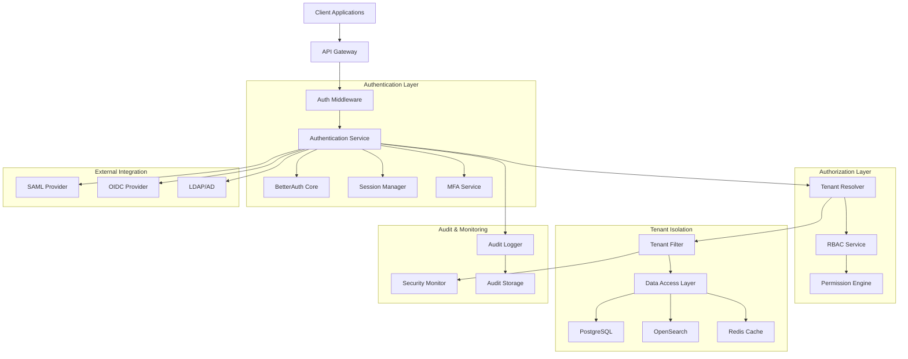

# Design Document: Authentication & Tenant Management

## Overview

The Authentication & Tenant Management system provides enterprise-grade security and multi-tenancy for the Betalogs platform. Built on BetterAuth foundations, it implements comprehensive authentication flows, strict tenant isolation, role-based access control, and extensive audit logging. The design emphasizes security-first principles with defense-in-depth strategies, ensuring customer data remains completely isolated while providing seamless user experiences and robust administrative controls.

## Architecture

The authentication and tenant management follows a layered security architecture:



The architecture enforces security at multiple layers with authentication, authorization, tenant isolation, and comprehensive audit logging working together to provide enterprise-grade security.

## Components and Interfaces

### Authentication Service
**Responsibility**: Core authentication orchestration and BetterAuth integration
**Interface**:
```typescript
interface AuthenticationService {
  authenticate(credentials: AuthCredentials): Promise<AuthResult>
  validateSession(sessionToken: string): Promise<SessionValidation>
  refreshSession(refreshToken: string): Promise<SessionRefresh>
  logout(sessionToken: string): Promise<LogoutResult>
  setupMFA(userId: string, method: MFAMethod): Promise<MFASetupResult>
}

interface AuthCredentials {
  type: 'password' | 'saml' | 'oidc' | 'api_key'
  username?: string
  password?: string
  samlResponse?: string
  oidcToken?: string
  apiKey?: string
  mfaToken?: string
  tenantHint?: string
}

interface AuthResult {
  success: boolean
  sessionToken?: string
  refreshToken?: string
  user?: AuthenticatedUser
  tenant?: TenantContext
  requiresMFA?: boolean
  mfaChallenge?: MFAChallenge
  error?: AuthError
}

interface AuthenticatedUser {
  userId: string
  email: string
  displayName: string
  roles: UserRole[]
  permissions: Permission[]
  tenantId: string
  lastLoginAt: Date
  mfaEnabled: boolean
}
```

### Tenant Resolver
**Responsibility**: Tenant context determination and isolation enforcement
**Interface**:
```typescript
interface TenantResolver {
  resolveTenant(context: TenantResolutionContext): Promise<TenantContext>
  validateTenantAccess(userId: string, tenantId: string): Promise<TenantAccessValidation>
  enforceTenantIsolation(query: DatabaseQuery, tenantId: string): Promise<DatabaseQuery>
  getTenantConfiguration(tenantId: string): Promise<TenantConfiguration>
}

interface TenantContext {
  tenantId: string
  tenantName: string
  domain?: string
  configuration: TenantConfiguration
  features: FeatureFlags
  limits: TenantLimits
  createdAt: Date
  status: 'active' | 'suspended' | 'trial'
}

interface TenantConfiguration {
  authenticationMethods: AuthMethod[]
  mfaRequired: boolean
  sessionTimeout: number
  apiKeySettings: APIKeySettings
  auditRetention: number
  customBranding?: BrandingSettings
  integrations: IntegrationSettings
}

interface FeatureFlags {
  searchEnabled: boolean
  briefGenerationEnabled: boolean
  githubIntegrationEnabled: boolean
  advancedAnalyticsEnabled: boolean
  customDashboardsEnabled: boolean
}
```

### RBAC Service
**Responsibility**: Role-based access control and permission management
**Interface**:
```typescript
interface RBACService {
  checkPermission(userId: string, resource: string, action: string): Promise<PermissionCheck>
  getUserRoles(userId: string, tenantId: string): Promise<UserRole[]>
  assignRole(userId: string, roleId: string, tenantId: string): Promise<RoleAssignment>
  createCustomRole(tenantId: string, roleDefinition: RoleDefinition): Promise<Role>
  getEffectivePermissions(userId: string, tenantId: string): Promise<Permission[]>
}

interface Permission {
  permissionId: string
  resource: string // 'stories', 'briefs', 'search', 'admin', etc.
  actions: string[] // 'read', 'write', 'delete', 'admin'
  conditions?: PermissionCondition[]
  scope: 'tenant' | 'global'
}

interface UserRole {
  roleId: string
  roleName: string
  permissions: Permission[]
  isCustom: boolean
  tenantId: string
  assignedAt: Date
  assignedBy: string
}

interface RoleDefinition {
  name: string
  description: string
  permissions: Permission[]
  isDefault: boolean
  tenantId: string
}

// Built-in roles
type SystemRole =
  | 'tenant_admin'    // Full tenant management
  | 'operator'        // Search, stories, briefs
  | 'analyst'         // Read-only analysis access
  | 'viewer'          // Basic read-only access
  | 'api_user'        // Programmatic access only
```

### Session Manager
**Responsibility**: Secure session lifecycle management
**Interface**:
```typescript
interface SessionManager {
  createSession(user: AuthenticatedUser, options: SessionOptions): Promise<Session>
  validateSession(sessionToken: string): Promise<SessionValidation>
  refreshSession(refreshToken: string): Promise<SessionRefresh>
  revokeSession(sessionToken: string): Promise<void>
  revokeAllUserSessions(userId: string): Promise<void>
}

interface Session {
  sessionId: string
  sessionToken: string
  refreshToken: string
  userId: string
  tenantId: string
  createdAt: Date
  expiresAt: Date
  lastAccessedAt: Date
  ipAddress: string
  userAgent: string
  permissions: Permission[]
  metadata: SessionMetadata
}

interface SessionOptions {
  rememberMe?: boolean
  ipAddress: string
  userAgent: string
  deviceFingerprint?: string
  extendedTimeout?: boolean
}

interface SessionValidation {
  isValid: boolean
  session?: Session
  user?: AuthenticatedUser
  tenant?: TenantContext
  requiresRefresh?: boolean
  error?: SessionError
}
```

### API Key Manager
**Responsibility**: Programmatic access token management
**Interface**:
```typescript
interface APIKeyManager {
  generateAPIKey(request: APIKeyRequest): Promise<APIKey>
  validateAPIKey(keyValue: string): Promise<APIKeyValidation>
  rotateAPIKey(keyId: string): Promise<APIKey>
  revokeAPIKey(keyId: string): Promise<void>
  listAPIKeys(tenantId: string): Promise<APIKey[]>
}

interface APIKeyRequest {
  tenantId: string
  name: string
  description?: string
  permissions: Permission[]
  expiresAt?: Date
  ipWhitelist?: string[]
  rateLimit?: RateLimit
  createdBy: string
}

interface APIKey {
  keyId: string
  keyValue: string // Only returned on creation
  keyHash: string
  name: string
  tenantId: string
  permissions: Permission[]
  createdAt: Date
  expiresAt?: Date
  lastUsedAt?: Date
  isActive: boolean
  usage: APIKeyUsage
}

interface APIKeyValidation {
  isValid: boolean
  apiKey?: APIKey
  tenant?: TenantContext
  effectivePermissions?: Permission[]
  rateLimitStatus?: RateLimitStatus
  error?: APIKeyError
}
```

### Audit Logger
**Responsibility**: Comprehensive security and compliance logging
**Interface**:
```typescript
interface AuditLogger {
  logAuthEvent(event: AuthAuditEvent): Promise<void>
  logAuthzEvent(event: AuthzAuditEvent): Promise<void>
  logTenantEvent(event: TenantAuditEvent): Promise<void>
  logSecurityEvent(event: SecurityAuditEvent): Promise<void>
  queryAuditLogs(query: AuditQuery): Promise<AuditLogResult>
}

interface AuthAuditEvent {
  eventType: 'login_attempt' | 'login_success' | 'login_failure' | 'logout' | 'session_expired'
  userId?: string
  tenantId?: string
  timestamp: Date
  ipAddress: string
  userAgent: string
  authMethod: string
  mfaUsed: boolean
  failureReason?: string
  metadata: Record<string, any>
}

interface AuthzAuditEvent {
  eventType: 'permission_check' | 'permission_denied' | 'role_assigned' | 'role_revoked'
  userId: string
  tenantId: string
  resource: string
  action: string
  decision: 'allow' | 'deny'
  reasoning: string
  timestamp: Date
  metadata: Record<string, any>
}

interface SecurityAuditEvent {
  eventType: 'tenant_isolation_violation' | 'suspicious_activity' | 'rate_limit_exceeded' | 'security_policy_violation'
  severity: 'low' | 'medium' | 'high' | 'critical'
  userId?: string
  tenantId?: string
  description: string
  evidence: Record<string, any>
  timestamp: Date
  resolved: boolean
}
```

## Data Models

### Authentication Schema (PostgreSQL)
```sql
-- Tenants table with configuration
CREATE TABLE tenants (
  tenant_id UUID PRIMARY KEY,
  tenant_name VARCHAR(100) NOT NULL UNIQUE,
  domain VARCHAR(255),
  status tenant_status NOT NULL DEFAULT 'active',

  -- Configuration
  configuration JSONB NOT NULL DEFAULT '{}'::jsonb,
  feature_flags JSONB NOT NULL DEFAULT '{}'::jsonb,
  limits JSONB NOT NULL DEFAULT '{}'::jsonb,

  -- Metadata
  created_at TIMESTAMPTZ NOT NULL DEFAULT NOW(),
  updated_at TIMESTAMPTZ NOT NULL DEFAULT NOW(),
  created_by UUID,

  -- Constraints
  CONSTRAINT valid_domain CHECK (domain ~ '^[a-zA-Z0-9][a-zA-Z0-9-]*[a-zA-Z0-9]*\.[a-zA-Z]{2,}$' OR domain IS NULL)
);

-- Users table with tenant association
CREATE TABLE users (
  user_id UUID PRIMARY KEY,
  tenant_id UUID NOT NULL REFERENCES tenants(tenant_id) ON DELETE CASCADE,
  email VARCHAR(255) NOT NULL,
  email_verified BOOLEAN NOT NULL DEFAULT FALSE,
  display_name VARCHAR(100) NOT NULL,

  -- Authentication
  password_hash VARCHAR(255),
  mfa_enabled BOOLEAN NOT NULL DEFAULT FALSE,
  mfa_secret VARCHAR(255),
  backup_codes TEXT[],

  -- Status and metadata
  status user_status NOT NULL DEFAULT 'active',
  last_login_at TIMESTAMPTZ,
  created_at TIMESTAMPTZ NOT NULL DEFAULT NOW(),
  updated_at TIMESTAMPTZ NOT NULL DEFAULT NOW(),

  -- Tenant isolation
  CONSTRAINT users_tenant_isolation CHECK (tenant_id IS NOT NULL),
  UNIQUE (tenant_id, email)
);

-- Roles and permissions
CREATE TABLE roles (
  role_id UUID PRIMARY KEY,
  tenant_id UUID REFERENCES tenants(tenant_id) ON DELETE CASCADE,
  role_name VARCHAR(50) NOT NULL,
  description TEXT,
  permissions JSONB NOT NULL DEFAULT '[]'::jsonb,
  is_system_role BOOLEAN NOT NULL DEFAULT FALSE,
  is_default BOOLEAN NOT NULL DEFAULT FALSE,

  created_at TIMESTAMPTZ NOT NULL DEFAULT NOW(),
  created_by UUID REFERENCES users(user_id),

  -- Tenant scoping (NULL for system roles)
  CONSTRAINT roles_tenant_scoping CHECK (
    (is_system_role = TRUE AND tenant_id IS NULL) OR
    (is_system_role = FALSE AND tenant_id IS NOT NULL)
  ),
  UNIQUE (tenant_id, role_name)
);

-- User role assignments
CREATE TABLE user_roles (
  user_id UUID NOT NULL REFERENCES users(user_id) ON DELETE CASCADE,
  role_id UUID NOT NULL REFERENCES roles(role_id) ON DELETE CASCADE,
  tenant_id UUID NOT NULL REFERENCES tenants(tenant_id) ON DELETE CASCADE,

  assigned_at TIMESTAMPTZ NOT NULL DEFAULT NOW(),
  assigned_by UUID REFERENCES users(user_id),
  expires_at TIMESTAMPTZ,

  PRIMARY KEY (user_id, role_id, tenant_id),

  -- Ensure role belongs to same tenant
  CONSTRAINT user_roles_tenant_consistency CHECK (
    tenant_id = (SELECT tenant_id FROM users WHERE user_id = user_roles.user_id)
  )
);

-- Sessions table
CREATE TABLE sessions (
  session_id UUID PRIMARY KEY,
  session_token_hash VARCHAR(255) NOT NULL UNIQUE,
  refresh_token_hash VARCHAR(255) NOT NULL UNIQUE,

  user_id UUID NOT NULL REFERENCES users(user_id) ON DELETE CASCADE,
  tenant_id UUID NOT NULL REFERENCES tenants(tenant_id) ON DELETE CASCADE,

  created_at TIMESTAMPTZ NOT NULL DEFAULT NOW(),
  expires_at TIMESTAMPTZ NOT NULL,
  last_accessed_at TIMESTAMPTZ NOT NULL DEFAULT NOW(),

  -- Client information
  ip_address INET NOT NULL,
  user_agent TEXT,
  device_fingerprint VARCHAR(255),

  -- Session metadata
  metadata JSONB DEFAULT '{}'::jsonb,

  -- Tenant isolation
  CONSTRAINT sessions_tenant_isolation CHECK (
    tenant_id = (SELECT tenant_id FROM users WHERE user_id = sessions.user_id)
  )
);

-- API Keys table
CREATE TABLE api_keys (
  key_id UUID PRIMARY KEY,
  key_hash VARCHAR(255) NOT NULL UNIQUE,
  key_name VARCHAR(100) NOT NULL,
  description TEXT,

  tenant_id UUID NOT NULL REFERENCES tenants(tenant_id) ON DELETE CASCADE,
  created_by UUID NOT NULL REFERENCES users(user_id),

  permissions JSONB NOT NULL DEFAULT '[]'::jsonb,

  created_at TIMESTAMPTZ NOT NULL DEFAULT NOW(),
  expires_at TIMESTAMPTZ,
  last_used_at TIMESTAMPTZ,
  is_active BOOLEAN NOT NULL DEFAULT TRUE,

  -- Usage tracking
  usage_count BIGINT NOT NULL DEFAULT 0,
  rate_limit JSONB,
  ip_whitelist INET[],

  -- Tenant isolation
  CONSTRAINT api_keys_tenant_isolation CHECK (tenant_id IS NOT NULL),
  UNIQUE (tenant_id, key_name)
);

-- Audit logs table
CREATE TABLE audit_logs (
  log_id UUID PRIMARY KEY,
  tenant_id UUID REFERENCES tenants(tenant_id),

  event_type VARCHAR(50) NOT NULL,
  event_category audit_category NOT NULL,
  severity audit_severity NOT NULL DEFAULT 'info',

  user_id UUID REFERENCES users(user_id),
  session_id UUID,
  api_key_id UUID REFERENCES api_keys(key_id),

  timestamp TIMESTAMPTZ NOT NULL DEFAULT NOW(),
  ip_address INET,
  user_agent TEXT,

  -- Event details
  resource VARCHAR(100),
  action VARCHAR(50),
  decision VARCHAR(20),
  reasoning TEXT,

  -- Flexible event data
  event_data JSONB NOT NULL DEFAULT '{}'::jsonb,

  -- Tamper evidence
  checksum VARCHAR(64) NOT NULL,

  -- Partitioning hint
  partition_date DATE NOT NULL DEFAULT CURRENT_DATE
);

-- Indexes for performance
CREATE INDEX CONCURRENTLY idx_users_tenant_email ON users (tenant_id, email);
CREATE INDEX CONCURRENTLY idx_sessions_user_tenant ON sessions (user_id, tenant_id);
CREATE INDEX CONCURRENTLY idx_sessions_expires ON sessions (expires_at) WHERE expires_at > NOW();
CREATE INDEX CONCURRENTLY idx_api_keys_tenant_active ON api_keys (tenant_id, is_active);
CREATE INDEX CONCURRENTLY idx_audit_logs_tenant_timestamp ON audit_logs (tenant_id, timestamp DESC);
CREATE INDEX CONCURRENTLY idx_audit_logs_user_timestamp ON audit_logs (user_id, timestamp DESC) WHERE user_id IS NOT NULL;
```

## Correctness Properties

*A property is a characteristic or behavior that should hold true across all valid executions of a system—essentially, a formal statement about what the system should do. Properties serve as the bridge between human-readable specifications and machine-verifiable correctness guarantees.*

Now I need to analyze the acceptance criteria to determine which ones can be tested as properties:

<function_calls>
<invoke name="prework">
<parameter name="featureName">authentication-tenant-management
