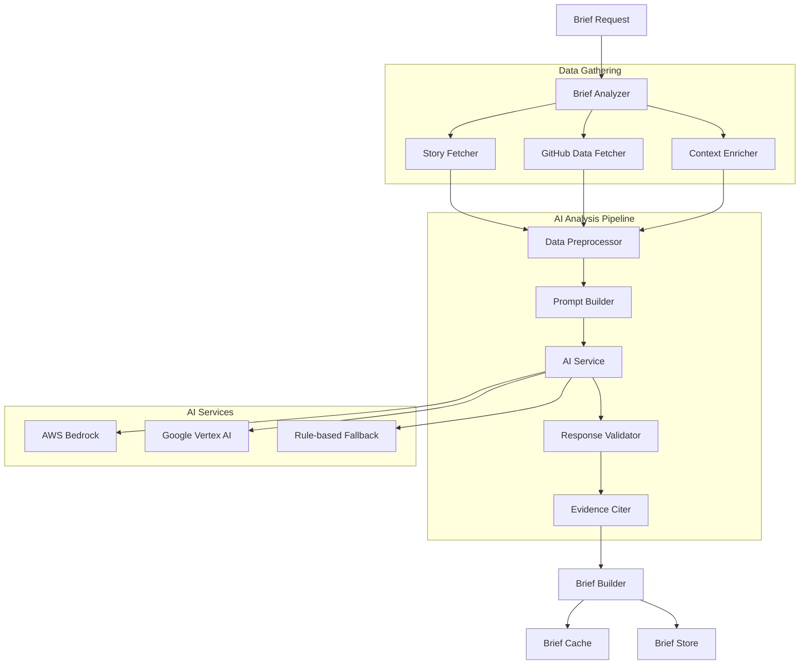

# Design Document: Brief Generation

## Overview

The Brief Generation system leverages AI to transform operational data into actionable intelligence for incident response. It analyzes individual stories or failure clusters using large language models to provide comprehensive diagnostic briefs that include root cause analysis, impact assessment, suspect change correlation, and prioritized action plans. The design emphasizes evidence-based conclusions, fast response times, and seamless integration with existing story and search infrastructure while maintaining strict tenant isolation and data quality controls.

## Architecture

The brief generation follows an AI-powered analysis pipeline:



The pipeline gathers relevant data, preprocesses it for AI analysis, generates insights using multiple AI services with fallback options, validates responses, and builds comprehensive briefs with proper evidence citation.

## Components and Interfaces

### Brief Analyzer
**Responsibility**: Orchestrates brief generation process and coordinates data gathering
**Interface**:
```typescript
interface BriefAnalyzer {
  generateBrief(request: BriefRequest): Promise<Brief>
  generateClusterBrief(cluster: FailureCluster, request: BriefRequest): Promise<Brief>
  regenerateBrief(briefId: string, updates: BriefUpdateRequest): Promise<Brief>
}

interface BriefRequest {
  tenantId: string
  storyId?: string
  clusterId?: string
  customQuestions?: string[]
  focusAreas?: BriefFocusArea[]
  includeGitHubAnalysis?: boolean
  urgencyLevel?: 'low' | 'medium' | 'high' | 'critical'
}

interface BriefFocusArea {
  type: 'root_cause' | 'impact_assessment' | 'change_correlation' | 'next_steps'
  priority: number
  specificQuestions?: string[]
}
```

### AI Service Integration
**Responsibility**: Multi-provider AI service integration with fallback capabilities
**Interface**:
```typescript
interface AIService {
  generateAnalysis(prompt: AnalysisPrompt, config: AIConfig): Promise<AIResponse>
  validateResponse(response: AIResponse, criteria: ValidationCriteria): Promise<ValidationResult>
  getServiceHealth(): Promise<ServiceHealthStatus>
}

interface AnalysisPrompt {
  systemPrompt: string
  userPrompt: string
  context: AnalysisContext
  constraints: PromptConstraints
}

interface AnalysisContext {
  storyData: Story | FailureCluster
  githubData?: GitHubChangeData
  environmentContext: EnvironmentContext
  historicalPatterns?: HistoricalPattern[]
}

interface AIResponse {
  analysis: string
  confidence: number
  reasoning: string[]
  citations: string[]
  metadata: AIResponseMetadata
}
```

### Brief Model
**Responsibility**: Structured brief representation with evidence tracking
**Interface**:
```typescript
interface Brief {
  briefId: string
  tenantId: string

  // Source data
  sourceType: 'story' | 'cluster'
  sourceId: string
  generatedAt: Date

  // Analysis results
  summary: BriefSummary
  rootCauseAnalysis: RootCauseAnalysis
  impactAssessment: ImpactAssessment
  suspectChanges: SuspectChange[]
  nextSteps: NextStepsChecklist

  // Evidence and citations
  evidenceCitations: EvidenceCitation[]
  confidenceScore: number
  analysisLimitations: string[]

  // Metadata
  customQuestions?: CustomQuestionResponse[]
  focusAreas: BriefFocusArea[]
  aiProvider: string
  processingTime: number
  version: number
}

interface BriefSummary {
  whatHappened: string
  whenItHappened: { start: Date, end: Date, duration: number }
  whereItHappened: { services: string[], environments: string[] }
  whoWasAffected: { userCount?: number, requestCount?: number, description: string }
  currentStatus: 'ongoing' | 'resolved' | 'intermittent' | 'unknown'
}

interface RootCauseAnalysis {
  primaryCause: CauseHypothesis
  contributingFactors: CauseHypothesis[]
  analysisMethod: 'ai_analysis' | 'pattern_matching' | 'rule_based'
  certaintyLevel: 'high' | 'medium' | 'low'
}

interface CauseHypothesis {
  description: string
  evidence: EvidenceCitation[]
  likelihood: number // 0-1 scale
  category: 'code_change' | 'infrastructure' | 'external_dependency' | 'configuration' | 'user_behavior'
}
```

### GitHub Integration
**Responsibility**: Change correlation and suspect change identification
**Interface**:
```typescript
interface GitHubAnalyzer {
  findSuspectChanges(regressionWindow: TimeWindow, affectedServices: string[]): Promise<SuspectChange[]>
  analyzeChangeImpact(changes: GitHubChange[], story: Story): Promise<ChangeImpactAnalysis>
  getChangeDetails(commitSha: string, repository: string): Promise<GitHubChangeDetails>
}

interface SuspectChange {
  changeId: string
  type: 'commit' | 'pr_merge' | 'deployment'
  timestamp: Date

  // Change details
  repository: string
  commitSha?: string
  prNumber?: number
  deploymentId?: string

  // Impact analysis
  affectedServices: string[]
  changeDescription: string
  riskLevel: 'low' | 'medium' | 'high'
  correlationStrength: number // 0-1 scale

  // Evidence
  evidenceLinks: EvidenceLink[]
  impactReasoning: string
}

interface ChangeImpactAnalysis {
  overallRisk: 'low' | 'medium' | 'high'
  affectedComponents: string[]
  changeComplexity: number
  testCoverage?: number
  rollbackFeasibility: 'easy' | 'moderate' | 'difficult'
}
```

### Evidence Citation System
**Responsibility**: Tracks and validates all evidence supporting brief conclusions
**Interface**:
```typescript
interface EvidenceCiter {
  citeStoryEvidence(storyId: string, eventIds: string[]): Promise<EvidenceCitation[]>
  citeGitHubEvidence(changes: SuspectChange[]): Promise<EvidenceCitation[]>
  citeMetricsEvidence(metrics: MetricsData): Promise<EvidenceCitation[]>
  validateCitations(citations: EvidenceCitation[]): Promise<CitationValidation>
}

interface EvidenceCitation {
  citationId: string
  type: 'story_event' | 'trace_data' | 'github_change' | 'metrics_data' | 'external_link'

  // Source identification
  sourceId: string
  sourceDescription: string
  sourceUrl?: string

  // Citation details
  relevantData: any
  supportsClaim: string
  confidenceLevel: number

  // Metadata
  retrievedAt: Date
  tenantId: string
}
```

### Next Steps Generator
**Responsibility**: Creates actionable, prioritized response checklists
**Interface**:
```typescript
interface NextStepsGenerator {
  generateActionPlan(analysis: RootCauseAnalysis, impact: ImpactAssessment): Promise<NextStepsChecklist>
  prioritizeActions(actions: ActionItem[], urgency: string): Promise<ActionItem[]>
  suggestContacts(services: string[], issueType: string): Promise<ContactSuggestion[]>
}

interface NextStepsChecklist {
  immediateActions: ActionItem[]
  investigationActions: ActionItem[]
  mitigationActions: ActionItem[]
  preventionActions: ActionItem[]

  estimatedTimeToResolution: string
  escalationCriteria: string[]
}

interface ActionItem {
  actionId: string
  priority: 'critical' | 'high' | 'medium' | 'low'
  category: 'immediate' | 'investigation' | 'mitigation' | 'prevention'

  description: string
  rationale: string
  estimatedTime: string

  // Execution details
  assignedRole?: string
  contactSuggestions?: ContactSuggestion[]
  requiredTools?: string[]
  dependencies?: string[]

  // Evidence
  supportingEvidence: EvidenceCitation[]
}
```

## Data Models

### Brief Storage Schema (PostgreSQL)
```sql
-- Core brief metadata and analysis results
CREATE TABLE briefs (
  brief_id UUID PRIMARY KEY,
  tenant_id UUID NOT NULL,

  -- Source information
  source_type brief_source_type NOT NULL,
  source_id UUID NOT NULL,
  story_id UUID,
  cluster_id UUID,

  -- Analysis metadata
  generated_at TIMESTAMPTZ NOT NULL DEFAULT NOW(),
  ai_provider VARCHAR(50) NOT NULL,
  processing_time_ms INTEGER NOT NULL,
  confidence_score DECIMAL(3,2) CHECK (confidence_score >= 0 AND confidence_score <= 1),

  -- Brief content (stored as JSONB for flexibility)
  summary JSONB NOT NULL,
  root_cause_analysis JSONB NOT NULL,
  impact_assessment JSONB NOT NULL,
  suspect_changes JSONB DEFAULT '[]'::jsonb,
  next_steps JSONB NOT NULL,

  -- Evidence tracking
  evidence_citations JSONB DEFAULT '[]'::jsonb,
  analysis_limitations TEXT[],

  -- Custom analysis
  custom_questions JSONB,
  focus_areas JSONB,

  -- Versioning and updates
  version INTEGER NOT NULL DEFAULT 1,
  updated_at TIMESTAMPTZ NOT NULL DEFAULT NOW(),

  -- Tenant isolation
  CONSTRAINT briefs_tenant_isolation CHECK (tenant_id IS NOT NULL)
);

-- Indexes for efficient querying
CREATE INDEX CONCURRENTLY idx_briefs_tenant_generated ON briefs (tenant_id, generated_at DESC);
CREATE INDEX CONCURRENTLY idx_briefs_source ON briefs (source_type, source_id);
CREATE INDEX CONCURRENTLY idx_briefs_story_id ON briefs (story_id) WHERE story_id IS NOT NULL;
CREATE INDEX CONCURRENTLY idx_briefs_confidence ON briefs (tenant_id, confidence_score DESC);

-- Evidence citations table for detailed tracking
CREATE TABLE brief_evidence_citations (
  citation_id UUID PRIMARY KEY,
  brief_id UUID NOT NULL REFERENCES briefs(brief_id) ON DELETE CASCADE,
  tenant_id UUID NOT NULL,

  citation_type citation_type NOT NULL,
  source_id VARCHAR(200) NOT NULL,
  source_description TEXT NOT NULL,
  source_url TEXT,

  supports_claim TEXT NOT NULL,
  confidence_level DECIMAL(3,2) NOT NULL,
  relevant_data JSONB,

  retrieved_at TIMESTAMPTZ NOT NULL DEFAULT NOW(),

  CONSTRAINT citations_tenant_isolation CHECK (tenant_id IS NOT NULL)
);
```

### Brief Document Schema (OpenSearch)
```typescript
interface BriefDocument {
  briefId: string
  tenantId: string

  // Source and timing
  sourceType: string
  sourceId: string
  generatedAt: string // ISO format

  // Searchable content
  'summary.whatHappened': string
  'summary.currentStatus': string
  'rootCause.primaryCause': string
  'rootCause.category': string

  // Impact metrics (for filtering and aggregation)
  'impact.userCount'?: number
  'impact.severity': string
  'impact.services': string[]
  'impact.environments': string[]

  // Change correlation
  'changes.count': number
  'changes.repositories': string[]
  'changes.riskLevels': string[]

  // Analysis metadata
  confidenceScore: number
  aiProvider: string
  processingTime: number

  // Full brief for retrieval
  fullBrief: Brief

  // Search optimization
  searchableText: string // concatenated key information for full-text search
}
```

## Correctness Properties

*A property is a characteristic or behavior that should hold true across all valid executions of a system—essentially, a formal statement about what the system should do. Properties serve as the bridge between human-readable specifications and machine-verifiable correctness guarantees.*

Now I need to analyze the acceptance criteria to determine which ones can be tested as properties:

<function_calls>
<invoke name="prework">
<parameter name="featureName">brief-generation
### Property 1: Story Analysis Completeness
*For any* individual story, brief generation should analyze the timeline and events, identify primary failure points with proper classification, provide clear event sequences, analyze error patterns with root cause suggestions, and cite specific supporting evidence.
**Validates: Requirements 1.1, 1.2, 1.3, 1.4, 1.5**

### Property 2: Cluster Analysis Comprehensiveness
*For any* failure cluster, brief generation should analyze common patterns across all stories, identify impact scope including affected users and services, determine if failures are systemic or isolated, suggest issue status (ongoing/resolved/intermittent), and provide statistical analysis of failure patterns.
**Validates: Requirements 2.1, 2.2, 2.3, 2.4, 2.5**

### Property 3: Change Correlation Accuracy
*For any* brief generation request, the system should identify appropriate regression windows, correlate GitHub changes within those windows, prioritize changes affecting involved services, include complete change information (SHAs, PRs, timestamps), and analyze recent changes when regression windows are unclear.
**Validates: Requirements 3.1, 3.2, 3.3, 3.4, 3.5**

### Property 4: Impact Assessment Completeness
*For any* generated brief, impact assessment should calculate affected users/requests/transactions, determine issue duration and ongoing status, identify affected services and environments, calculate severity considering multiple factors, and provide both quantitative metrics and qualitative descriptions.
**Validates: Requirements 4.1, 4.2, 4.3, 4.4, 4.5**

### Property 5: Action Plan Generation
*For any* brief, next steps should include prioritized immediate response actions, both immediate and long-term fixes, specific actionable recommendations (contacts, systems, procedures), identified rollback options when available, and rationale for each recommended action.
**Validates: Requirements 5.1, 5.2, 5.3, 5.4, 5.5**

### Property 6: Evidence Citation Integrity
*For any* brief conclusion or claim, it should be supported with specific evidence citations (story IDs, event IDs, trace IDs), include links to external resources, reference underlying data sources and time ranges for statistics, explain evidence supporting correlations, and avoid unsupported claims or clearly mark speculation.
**Validates: Requirements 6.1, 6.2, 6.3, 6.4, 6.5**

### Property 7: Progress Indication
*For any* brief generation that takes longer than expected, progress indicators and partial results should be provided to maintain user awareness.
**Validates: Requirements 7.4**

### Property 8: Tenant Isolation Enforcement
*For any* brief generation operation, strict tenant isolation should be maintained with analysis limited to requesting tenant data, tenant-specific external access controls, tenant-based cache isolation, security violation rejection and logging, and audit trail creation with tenant context.
**Validates: Requirements 8.1, 8.2, 8.3, 8.4, 8.5**

### Property 9: Custom Analysis Support
*For any* brief request, the system should accept optional questions and focus areas, prioritize addressing custom concerns, maintain comprehensive analysis while emphasizing requested focus, clearly indicate data limitations when questions cannot be answered, and support common question types.
**Validates: Requirements 9.1, 9.2, 9.3, 9.4, 9.5**

### Property 10: Graceful Error Handling
*For any* problematic scenario (AI service unavailability, incomplete data, uncertain results, generation failures, inappropriate AI responses), the system should provide graceful degradation with rule-based fallbacks, work with available data while indicating limitations, present multiple hypotheses with confidence levels, provide meaningful error messages with alternatives, and implement quality validation and filtering.
**Validates: Requirements 10.1, 10.2, 10.3, 10.4, 10.5**

## Error Handling

### AI Service Errors
- **Service Unavailability**: Implement circuit breaker with rule-based fallback analysis
- **Response Quality Issues**: Validate AI responses and filter inappropriate content
- **Rate Limiting**: Implement request queuing and retry mechanisms with exponential backoff
- **Model Errors**: Provide graceful degradation with reduced functionality

### Data Quality Errors
- **Incomplete Story Data**: Work with available data and clearly indicate limitations
- **Corrupted Evidence**: Validate evidence citations and mark unreliable sources
- **Missing GitHub Data**: Continue analysis without change correlation and note limitations
- **Conflicting Information**: Present multiple hypotheses with confidence levels

### Analysis Errors
- **Uncertain Results**: Provide multiple hypotheses with confidence scoring
- **Correlation Failures**: Fall back to pattern-based analysis with lower confidence
- **Timeline Reconstruction Errors**: Use available events and mark gaps in timeline
- **Impact Calculation Errors**: Provide ranges and uncertainty indicators

### System Errors
- **Cache Failures**: Fall back to real-time analysis with performance impact
- **Database Unavailability**: Use cached data where available and indicate staleness
- **External Service Failures**: Continue with internal analysis and note missing external data
- **Memory/Processing Limits**: Implement sampling and progressive analysis

## Testing Strategy

### Dual Testing Approach
The brief generation system will be validated through both unit tests and property-based tests:

- **Unit tests**: Verify specific analysis scenarios, AI integration, and error conditions
- **Property tests**: Verify universal properties across all story types and analysis scenarios
- Both approaches are complementary and necessary for comprehensive coverage

### Property-Based Testing Configuration
- **Framework**: fast-check for TypeScript/JavaScript property-based testing
- **Test Iterations**: Minimum 100 iterations per property test
- **Test Tagging**: Each property test tagged with format: **Feature: brief-generation, Property {number}: {property_text}**

### Unit Testing Focus Areas
- Specific brief generation scenarios with known stories and expected analysis outcomes
- AI service integration with mocked responses and error conditions
- Evidence citation accuracy and completeness validation
- GitHub change correlation with various change patterns
- Edge cases: incomplete data, service failures, unusual story patterns

### Property Testing Focus Areas
- Universal brief generation behavior across all story types and complexity levels
- Evidence citation integrity across all analysis scenarios and data variations
- Tenant isolation enforcement across all possible multi-tenant scenarios
- Custom analysis support across all question types and focus area combinations

### Test Data Strategy
- **Generators**: Smart property test generators that create realistic story and cluster scenarios
- **AI Response Mocking**: Controlled AI responses to test analysis logic independently
- **Multi-tenant Data**: Stories from multiple tenants to verify isolation boundaries
- **GitHub Integration**: Mock GitHub data with various change patterns and timing
- **Edge Cases**: Incomplete stories, corrupted data, service failures, unusual patterns

### AI Testing Considerations
- **Response Validation**: Test AI response validation and filtering mechanisms
- **Fallback Testing**: Verify rule-based fallback analysis when AI services fail
- **Quality Assurance**: Test inappropriate response detection and handling
- **Performance Testing**: Validate response time requirements with various AI providers

Each correctness property will be implemented as a single property-based test that validates the universal behavior described in the property statement.
