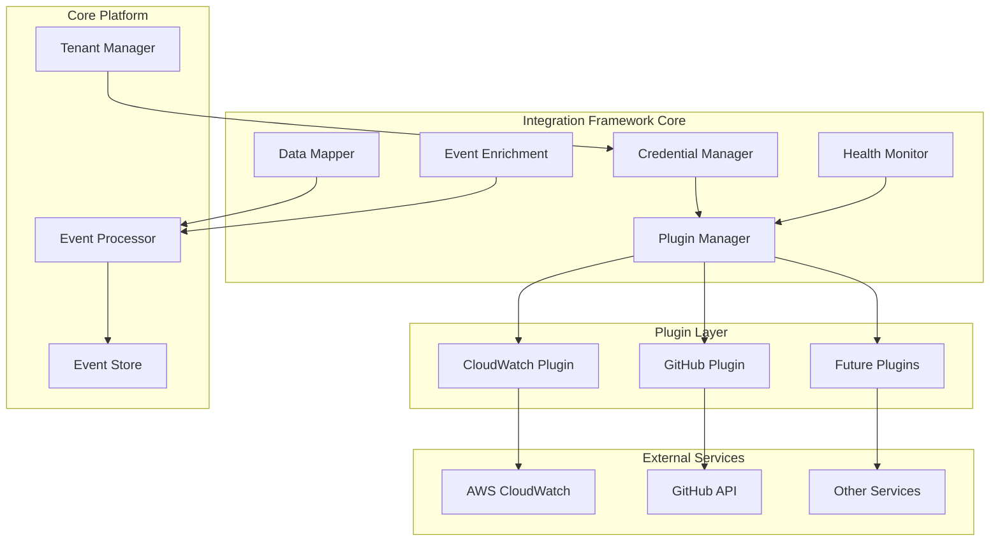

# Design Document

## Overview

The Integrations system implements a plugin-based architecture that enables seamless connectivity with external services while maintaining the platform's core principles of tenant isolation, security, and reliability. The design follows established plugin architecture patterns with a standardized interface, secure credential management, and extensible data transformation capabilities.

The system starts with CloudWatch and GitHub integrations as foundational plugins, establishing patterns that will support future integrations including JIRA, Teams, Slack, GitLab, and various log systems. The architecture emphasizes modularity, allowing new integrations to be developed and deployed independently without modifying core system components.

## Architecture

The integration framework follows a layered architecture with clear separation of concerns:



### Core Components

**Plugin Manager**: Orchestrates plugin lifecycle, registration, and execution. Implements the factory pattern for plugin instantiation and maintains plugin registry with version management.

**Credential Manager**: Provides secure storage and management of authentication credentials using tenant-specific encryption. Supports multiple authentication methods including API keys, OAuth tokens, and service account credentials.

**Data Mapper**: Transforms external service data into canonical event format using configurable field mappings. Implements the adapter pattern to normalize diverse external schemas.

**Health Monitor**: Continuously monitors integration status, implements circuit breaker patterns, and provides automatic recovery mechanisms with exponential backoff strategies.

**Event Enrichment**: Enhances existing events with context from external services using correlation identifiers and temporal proximity matching.

## Components and Interfaces

### Plugin Interface

All integration plugins must implement the standardized `IntegrationPlugin` interface:

```typescript
interface IntegrationPlugin {
  readonly name: string;
  readonly version: string;
  readonly supportedEvents: EventType[];

  initialize(config: PluginConfiguration): Promise<void>;
  authenticate(credentials: PluginCredentials): Promise<AuthResult>;
  fetchData(request: DataRequest): Promise<ExternalData[]>;
  transformData(data: ExternalData): Promise<CanonicalEvent>;
  healthCheck(): Promise<HealthStatus>;
  shutdown(): Promise<void>;
}
```

### Plugin Configuration

Each plugin maintains tenant-specific configuration:

```typescript
interface PluginConfiguration {
  tenantId: string;
  pluginName: string;
  settings: Record<string, any>;
  credentials: EncryptedCredentials;
  featureFlags: PluginFeatureFlags;
  rateLimits: RateLimitConfig;
}
```

### Data Transformation Pipeline

The data transformation follows a consistent pipeline:

1. **Ingestion**: External service data is received via webhooks or polling
2. **Validation**: Data structure and authentication are validated
3. **Mapping**: External schema is mapped to canonical event format
4. **Enrichment**: Additional context is added from correlation identifiers
5. **Routing**: Transformed events are routed to the event processor

### CloudWatch Plugin Implementation

The CloudWatch plugin implements specific patterns for AWS integration:

**Authentication**: Uses AWS IAM roles or access keys with automatic credential rotation support.

**Data Sources**:
- CloudWatch Metrics: Transformed into system events with metric values as event context
- CloudWatch Logs: Log entries are parsed and converted to system or security events
- CloudWatch Alarms: Alarm state changes generate system events with severity classification

**Correlation Strategy**: Links CloudWatch data to existing events using:
- AWS resource identifiers (instance IDs, service names)
- Temporal correlation within configurable time windows
- Custom tags and metadata matching

### GitHub Plugin Implementation

The GitHub plugin implements webhook-based integration patterns:

**Authentication**: Uses GitHub App installation tokens or personal access tokens with automatic renewal.

**Event Types**:
- Commit events: Transformed into delivery events with commit metadata
- Pull request events: Generate delivery events with PR lifecycle information
- Deployment events: Create delivery events with deployment context
- Release events: Generate delivery events with release information

**Evidence Linking**: Creates evidence links to:
- Commit SHAs and diff URLs
- Pull request pages and review comments
- Deployment records and environment information
- Release notes and artifact locations

## Data Models

### Canonical Event Extensions

Integration plugins extend the canonical event model with integration-specific context:

```typescript
interface IntegrationContext {
  sourceIntegration: string;
  externalId: string;
  originalTimestamp: string;
  correlationHints: CorrelationHint[];
  evidenceLinks: EvidenceLink[];
  enrichmentMetadata: EnrichmentMetadata;
}

interface CorrelationHint {
  type: 'resource_id' | 'temporal' | 'metadata';
  value: string;
  confidence: number;
}

interface EvidenceLink {
  type: 'commit' | 'pr' | 'deployment' | 'metric' | 'log';
  url: string;
  description: string;
  metadata: Record<string, any>;
}
```

### Plugin Registry Schema

The plugin registry maintains metadata for all available plugins:

```typescript
interface PluginRegistryEntry {
  name: string;
  version: string;
  description: string;
  author: string;
  supportedEvents: EventType[];
  requiredCredentials: CredentialType[];
  configurationSchema: JSONSchema;
  dependencies: PluginDependency[];
  status: 'active' | 'inactive' | 'deprecated';
}
```

## Correctness Properties

*A property is a characteristic or behavior that should hold true across all valid executions of a system-essentially, a formal statement about what the system should do. Properties serve as the bridge between human-readable specifications and machine-verifiable correctness guarantees.*

### Converting EARS to Properties

Based on the prework analysis, I've identified several key properties that capture the essential correctness requirements while eliminating redundancy:

**Property 1: Plugin Interface Standardization**
*For any* integration plugin, it must implement the standardized plugin interface with all required mesupport dynamic registration without core system modifications.
**Validates: Requirements 1.1, 1.2, 8.1, 8.2**

**Property 2: Comprehensive Tenant Isolation**
*For any* integration operation (configuration, data processing, credential storage), tenant isolation must be maintained with no cross-tenant data access or configuration interference.
**Validates: Requirements 2.5, 3.5, 5.1, 5.3**

**Property 3: Universal Authentication Support**
*For any* integration plugin, the credential manager must support the plugin's required authentication methods with secure storage and automatic renewal capabilities.
**Validates: Requirements 2.1, 3.1, 4.1, 4.2, 4.3**

**Property 4: Consistent Data Transformation**
*For any* external service data, the data mapper must transform it into canonical event format while preserving original context and maintaining schema validation.
**Validates: Requirements 2.2, 2.3, 3.2, 7.1, 7.2, 7.5**

**Property 5: Comprehensive Error Handling**
*For any* integration failure (authentication, data processing, external service unavailability), the system must implement appropriate error handling with retry mechanisms, circuit breakers, and graceful degradation.
**Validates: Requirements 4.4, 6.2, 7.3, 10.1, 10.2, 10.3, 10.5**

**Property 6: Plugin Lifecycle Management**
*For any* plugin, the integration framework must manage its complete lifecycle (initialization, configuration, health monitoring, shutdown) with proper isolation and restart capabilities.
**Validates: Requirements 1.5, 6.1, 10.4**

**Property 7: Evidence Link Creation**
*For any* external service data that supports correlation, the system must create appropriate evidence links with proper attribution to the source integration.
**Validates: Requirements 3.4, 9.4**

**Property 8: Event Enrichment Consistency**
*For any* event that can be enriched with external service context, the enrichment process must identify opportunities and add context while maintaining clear source attribution.
**Validates: Requirements 9.1, 9.2, 9.3, 9.4**

**Property 9: Configuration Management**
*For any* plugin configuration change, the system must validate permissions, apply changes without affecting other tenants, and maintain audit history.
**Validates: Requirements 5.2, 5.4, 5.5**

**Property 10: Health Monitoring and Performance**
*For any* active integration, the system must continuously monitor health status, track performance metrics, and provide monitoring interfaces.
**Validates: Requirements 6.1, 6.4, 6.5**

## Error Handling

The integration framework implements comprehensive error handling strategies:

### Circuit Breaker Pattern
- **Closed State**: Normal operation with success/failure tracking
- **Open State**: Requests fail fast when failure threshold is exceeded
- **Half-Open State**: Limited requests allowed to test service recovery

### Retry Mechanisms
- **Exponential Backoff**: Increasing delays between retry attempts
- **Jitter**: Random variation to prevent thundering herd problems
- **Maximum Attempts**: Configurable limits to prevent infinite retries

### Dead Letter Queues
- **Failed Operations**: Unprocessable requests are queued for manual review
- **Malformed Data**: Invalid external service data is preserved for analysis
- **Retry Exhaustion**: Operations that exceed retry limits are queued

### Graceful Degradation
- **Core Functionality**: Platform remains operational when integrations fail
- **Partial Features**: Some features may be limited but system remains stable
- **User Notification**: Clear indication when integration-dependent features are unavailable

## Testing Strategy

The integration system requires comprehensive testing across multiple dimensions:

### Unit Testing
- **Plugin Interface Compliance**: Verify all plugins implement required interface methods
- **Data Transformation Logic**: Test transformation of various external data formats
- **Credential Management**: Test encryption, storage, and retrieval of various credential types
- **Error Handling**: Test specific error scenarios and recovery mechanisms
- **Configuration Validation**: Test plugin configuration validation and tenant isolation

### Property-Based Testing
Property-based tests will validate universal properties across all inputs using a minimum of 100 iterations per test. Each test will be tagged with the format: **Feature: integrations, Property {number}: {property_text}**

- **Plugin Interface Standardization**: Generate various plugin implementations and verify interface compliance
- **Tenant Isolation**: Generate multi-tenant scenarios and verify no cross-tenant data access
- **Authentication Support**: Generate various credential types and verify secure handling
- **Data Transformation**: Generate diverse external data formats and verify canonical transformation
- **Error Handling**: Generate various failure scenarios and verify appropriate error responses
- **Plugin Lifecycle**: Generate plugin lifecycle events and verify proper management
- **Evidence Link Creation**: Generate external data with correlation hints and verify evidence links
- **Event Enrichment**: Generate events with enrichment opportunities and verify context addition
- **Configuration Management**: Generate configuration changes and verify proper handling
- **Health Monitoring**: Generate integration health scenarios and verify monitoring accuracy

### Integration Testing
- **End-to-End Workflows**: Test complete integration flows from external service to canonical events
- **Multi-Plugin Scenarios**: Test interactions between multiple active plugins
- **Tenant Boundary Testing**: Verify tenant isolation across all integration operations
- **External Service Simulation**: Test with mock external services to verify error handling
- **Performance Testing**: Verify integration performance under various load conditions

The testing strategy emphasizes both concrete examples through unit tests and comprehensive coverage through property-based testing, ensuring the integration framework maintains reliability and correctness across all supported external services.
