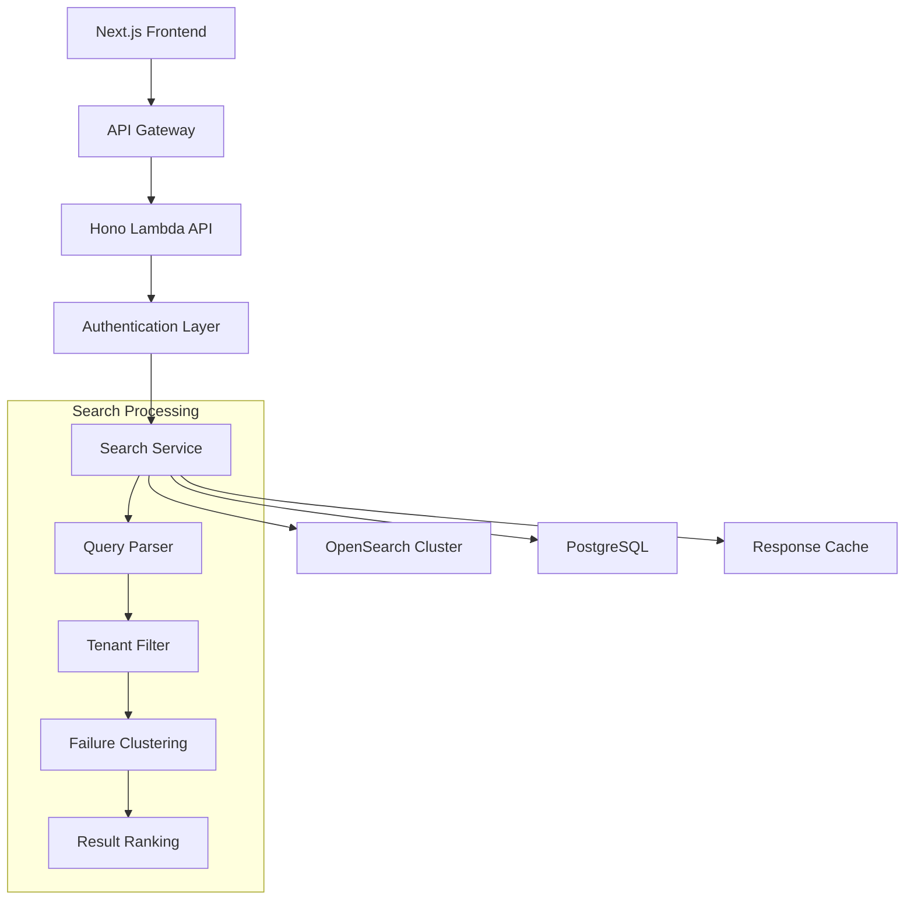

# Design Document: Search Functionality

## Overview

The Search Functionality provides a high-performance, multi-criteria search interface that enables operations teams to quickly locate relevant stories and failure clusters. The system leverages OpenSearch for fast full-text and structured queries, with PostgreSQL providing metadata and tenant isolation controls. The design emphasizes sub-second response times, strict tenant isolation, and intelligent failure clustering to support rapid incident response workflows.

## Architecture

The search functionality follows a layered architecture:



The API layer handles request validation and authentication, while the Search Service orchestrates query parsing, tenant filtering, OpenSearch queries, and result post-processing including failure clustering.

## Components and Interfaces

### Search API Controller
**Responsibility**: HTTP request handling, input validation, response formatting
**Interface**:
```typescript
interface SearchController {
  search(request: SearchRequest): Promise<SearchResponse>
}

interface SearchRequest {
  query: string
  filters: SearchFilters
  pagination: PaginationOptions
  tenantId: string // from auth context
}

interface SearchFilters {
  timeRange?: { from: Date, to: Date }
  environment?: string
  service?: string
  endpoint?: string
  outcome?: 'success' | 'failure'
  errorClass?: string
  errorCode?: string
}
```

### Search Service
**Responsibility**: Core search logic, query orchestration, result processing
**Interface**:
```typescript
interface SearchService {
  executeSearch(query: SearchQuery): Promise<SearchResults>
  clusterFailures(stories: Story[]): Promise<FailureCluster[]>
  rankResults(results: SearchResults): Promise<RankedResults>
}

interface SearchQuery {
  identifiers: SearchIdentifier[]
  filters: SearchFilters
  tenantId: string
  pagination: PaginationOptions
}

interface SearchIdentifier {
  type: 'email_hash' | 'userId' | 'orderId' | 'requestId' | 'traceId'
  value: string
}
```

### OpenSearch Repository
**Responsibility**: OpenSearch query execution, index management
**Interface**:
```typescript
interface OpenSearchRepository {
  searchStories(query: OpenSearchQuery): Promise<Story[]>
  aggregateFailures(filters: SearchFilters): Promise<FailureAggregation[]>
  healthCheck(): Promise<boolean>
}

interface OpenSearchQuery {
  must: QueryClause[]
  filter: FilterClause[]
  sort: SortClause[]
  from: number
  size: number
}
```

### Tenant Security Service
**Responsibility**: Tenant isolation enforcement, audit logging
**Interface**:
```typescript
interface TenantSecurityService {
  validateTenantAccess(tenantId: string, userId: string): Promise<boolean>
  applyTenantFilter(query: OpenSearchQuery, tenantId: string): OpenSearchQuery
  logSearchAudit(event: SearchAuditEvent): Promise<void>
}
```

## Data Models

### Story Document (OpenSearch)
```typescript
interface StoryDocument {
  storyId: string
  tenantId: string
  timestamp: Date
  timeRange: { start: Date, end: Date }

  // Primary identifiers
  emailHash?: string
  userId?: string
  orderId?: string
  requestId?: string
  traceId?: string

  // Classification
  outcome: 'success' | 'failure'
  errorClass?: string
  errorCode?: string

  // Context
  environment: string
  service: string
  endpoint?: string

  // Evidence
  eventCount: number
  traceAvailable: boolean
  evidenceLinks: string[]

  // Search optimization
  searchableText: string // concatenated identifiers and key fields
}
```

### Search Response Model
```typescript
interface SearchResponse {
  stories: StoryResult[]
  failureClusters: FailureCluster[]
  pagination: PaginationInfo
  executionTime: number
  totalResults: number
}

interface StoryResult {
  storyId: string
  timeRange: { start: Date, end: Date }
  outcome: 'success' | 'failure'
  primaryIdentifiers: Record<string, string>
  errorSummary?: string
  evidenceCount: number
  traceAvailable: boolean
  environment: string
  service: string
}

interface FailureCluster {
  clusterId: string
  errorClass: string
  errorCode?: string
  storyCount: number
  timeRange: { start: Date, end: Date }
  impactScore: number
  sampleStoryIds: string[]
}
```

## Correctness Properties

*A property is a characteristic or behavior that should hold true across all valid executions of a system—essentially, a formal statement about what the system should do. Properties serve as the bridge between human-readable specifications and machine-verifiable correctness guarantees.*

### Property 1: Identifier Search Completeness
*For any* search identifier (email_hash, userId, orderId, requestId, or traceId) and any collection of stories, searching by that identifier should return all and only the stories that contain that identifier in the corresponding field.
**Validates: Requirements 1.1, 1.2, 1.3, 1.4, 1.5**

### Property 2: Multi-term Search Union
*For any* set of search identifiers, the search results should contain all stories that match at least one of the provided identifiers.
**Validates: Requirements 1.6**

### Property 3: Filter Precision
*For any* search filter (time range, environment, service, endpoint, outcome, error classification) and any collection of stories, applying that filter should return all and only the stories that match the filter criteria.
**Validates: Requirements 2.1, 2.3, 2.4, 2.5, 2.6, 2.7**

### Property 4: Tenant Isolation Enforcement
*For any* search query and tenant context, the search results should contain only stories belonging to the authenticated tenant, and access attempts to other tenants should be rejected.
**Validates: Requirements 2.2, 6.1, 6.2**

### Property 5: Failure Clustering Consistency
*For any* collection of similar failures (same error class and code), they should be grouped into clusters with accurate size counts and common characteristics displayed.
**Validates: Requirements 3.1, 3.2**

### Property 6: Cluster Navigation Completeness
*For any* failure cluster, selecting it should provide access to all individual stories that were grouped into that cluster.
**Validates: Requirements 3.3**

### Property 7: Cluster Ranking Order
*For any* set of failure clusters with different impact scores and recency, they should be ranked with higher impact and more recent clusters appearing first.
**Validates: Requirements 3.4**

### Property 8: Pagination Consistency
*For any* search result set that exceeds the configured page size, the results should be paginated with consistent navigation controls and accurate total counts.
**Validates: Requirements 4.4**

### Property 9: Result Metadata Completeness
*For any* search result, the displayed information should include all required metadata: timeline bounds, outcome, primary identifiers, evidence counts, trace availability, and context information.
**Validates: Requirements 5.1, 5.2, 5.3, 5.4, 5.5**

### Property 10: Audit Trail Creation
*For any* search operation performed by an authenticated user, an audit log entry should be created with the search parameters and tenant context.
**Validates: Requirements 6.3**

### Property 11: Security Violation Handling
*For any* attempt to violate tenant isolation, the system should reject the query and log a security event.
**Validates: Requirements 6.4**

### Property 12: Empty Result Handling
*For any* search query that matches no stories, the system should return an empty result set with appropriate messaging.
**Validates: Requirements 7.1**

### Property 13: Error Message Clarity
*For any* malformed or invalid search query, the system should return descriptive error messages that help users understand the issue.
**Validates: Requirements 7.2**

### Property 14: Special Character Handling
*For any* search identifier containing special characters, the system should handle them appropriately without breaking or producing incorrect results.
**Validates: Requirements 7.3**

### Property 15: Query Limiting
*For any* extremely broad search query, the system should apply reasonable limits and inform users when results are truncated.
**Validates: Requirements 7.5**

Now I need to analyze the acceptance criteria to determine which ones can be tested as properties:

<function_calls>
<invoke name="prework">
<parameter name="featureName">search-functionality
## Error Handling

### Search Query Errors
- **Malformed Queries**: Return HTTP 400 with specific validation errors
- **Invalid Identifiers**: Sanitize input and return descriptive error messages
- **Missing Required Parameters**: Return HTTP 400 with parameter requirements

### System Errors
- **OpenSearch Unavailable**: Return HTTP 503 with retry-after headers
- **Database Connection Failures**: Graceful degradation with cached metadata
- **Timeout Errors**: Return HTTP 408 with partial results if available

### Security Errors
- **Tenant Isolation Violations**: Return HTTP 403 and log security events
- **Authentication Failures**: Return HTTP 401 with appropriate error codes
- **Rate Limiting**: Return HTTP 429 with retry-after headers

### Data Consistency Errors
- **Index Lag**: Include freshness indicators in responses
- **Partial Results**: Clearly indicate when results may be incomplete
- **Clustering Failures**: Fall back to unclustered results with warnings

## Testing Strategy

### Dual Testing Approach
The search functionality will be validated through both unit tests and property-based tests:

- **Unit tests**: Verify specific examples, edge cases, and error conditions
- **Property tests**: Verify universal properties across all inputs
- Both approaches are complementary and necessary for comprehensive coverage

### Property-Based Testing Configuration
- **Framework**: fast-check for TypeScript/JavaScript property-based testing
- **Test Iterations**: Minimum 100 iterations per property test
- **Test Tagging**: Each property test tagged with format: **Feature: search-functionality, Property {number}: {property_text}**

### Unit Testing Focus Areas
- Specific search scenarios with known inputs and expected outputs
- Edge cases: empty results, malformed queries, special characters
- Error conditions: service unavailability, timeout scenarios
- Integration points: OpenSearch queries, PostgreSQL metadata lookups

### Property Testing Focus Areas
- Universal search behavior across all identifier types and filter combinations
- Tenant isolation enforcement across all possible tenant configurations
- Result consistency and completeness across all data variations
- Error handling behavior across all possible invalid input combinations

### Test Data Strategy
- **Generators**: Smart property test generators that create realistic search scenarios
- **Tenant Isolation**: Multi-tenant test data to verify security boundaries
- **Performance**: Large datasets to validate pagination and performance characteristics
- **Edge Cases**: Special characters, Unicode, extremely long identifiers

Each correctness property will be implemented as a single property-based test that validates the universal behavior described in the property statement.
