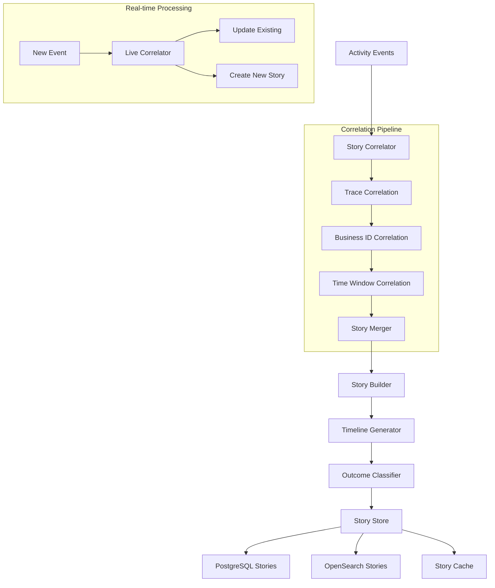

# Design Document: Story Reconstruction

## Overview

The Story Reconstruction system transforms fragmented activity events into coherent narratives by implementing sophisticated correlation algorithms. It prioritizes OpenTelemetry trace context for distributed system flows, falls back to business identifiers for legacy system integration, and uses time-window heuristics as a final correlation method. The design emphasizes real-time story building with batch processing capabilities, maintaining high performance through efficient indexing and correlation strategies while ensuring strict tenant isolation.

## Architecture

The story reconstruction follows a multi-stage correlation pipeline:



The pipeline processes events through multiple correlation strategies in priority order, builds comprehensive story timelines, and maintains both real-time updates and batch processing capabilities.

## Components and Interfaces

### Story Correlator
**Responsibility**: Event correlation using multiple strategies with priority ordering
**Interface**:
```typescript
interface StoryCorrelator {
  correlateEvents(events: CanonicalEvent[], context: CorrelationContext): Promise<StoryCandidate[]>
  correlateNewEvent(event: CanonicalEvent, existingStories: Story[]): Promise<CorrelationResult>
  validateCorrelation(correlation: EventCorrelation): Promise<CorrelationValidation>
}

interface CorrelationContext {
  tenantId: string
  timeWindow: TimeWindow
  correlationStrategies: CorrelationStrategy[]
  confidenceThresholds: ConfidenceThresholds
}

interface CorrelationResult {
  matchedStory?: Story
  correlationMethod: CorrelationMethod
  confidence: number
  shouldCreateNew: boolean
}

type CorrelationMethod = 'trace' | 'business_id' | 'time_window' | 'none'
```

### Story Builder
**Responsibility**: Story construction, timeline generation, outcome classification
**Interface**:
```typescript
interface StoryBuilder {
  buildStory(events: CanonicalEvent[], correlation: EventCorrelation): Promise<Story>
  generateTimeline(events: CanonicalEvent[]): Promise<StoryTimeline>
  classifyOutcome(events: CanonicalEvent[]): Promise<StoryOutcome>
  updateStory(existingStory: Story, newEvents: CanonicalEvent[]): Promise<Story>
}

interface Story {
  storyId: string
  tenantId: string

  // Temporal bounds
  timeRange: { start: Date, end: Date }
  duration: number

  // Correlation metadata
  correlationMethod: CorrelationMethod
  confidence: number
  completeness: number // 0-1 scale

  // Primary identifiers (from strongest correlation)
  primaryCorrelation: {
    traceId?: string
    requestId?: string
    orderId?: string
    sessionId?: string
    userId?: string
    email_hash?: string
  }

  // Story classification
  outcome: StoryOutcome
  category: EventCategory[]
  services: string[]
  environments: string[]

  // Timeline and events
  eventCount: number
  timeline: StoryTimeline
  keyTransitions: KeyTransition[]

  // Evidence and context
  evidenceLinks: EvidenceLink[]
  errorSummary?: ErrorSummary

  // Metadata
  createdAt: Date
  updatedAt: Date
  version: number
}
```

### Story Timeline
**Responsibility**: Chronological event sequencing with key transition identification
**Interface**:
```typescript
interface StoryTimeline {
  events: TimelineEvent[]
  keyTransitions: KeyTransition[]
  serviceFlow: ServiceTransition[]
  criticalPath: string[] // eventIds of critical events
}

interface TimelineEvent {
  eventId: string
  timestamp: Date
  category: EventCategory
  action: string
  service?: string
  outcome: 'success' | 'failure' | 'pending'
  isKeyTransition: boolean
  transitionType?: TransitionType
}

interface KeyTransition {
  fromEventId: string
  toEventId: string
  transitionType: TransitionType
  duration: number
  significance: number // 0-1 scale
}

type TransitionType =
  | 'service_boundary'
  | 'state_change'
  | 'error_occurrence'
  | 'recovery_attempt'
  | 'user_action'
  | 'system_response'
```

### Correlation Engine
**Responsibility**: Multi-strategy event correlation with confidence scoring
**Interface**:
```typescript
interface CorrelationEngine {
  correlateByTrace(events: CanonicalEvent[]): Promise<TraceCorrelation[]>
  correlateByBusinessId(events: CanonicalEvent[]): Promise<BusinessCorrelation[]>
  correlateByTimeWindow(events: CanonicalEvent[], window: TimeWindow): Promise<TimeCorrelation[]>
  calculateConfidence(correlation: EventCorrelation): Promise<number>
}

interface EventCorrelation {
  correlationId: string
  method: CorrelationMethod
  events: CanonicalEvent[]
  confidence: number
  metadata: CorrelationMetadata
}

interface CorrelationMetadata {
  primaryIdentifier: string
  secondaryIdentifiers: string[]
  timeSpan: number
  serviceCount: number
  conflictingCorrelations?: string[]
}
```

### Story Store
**Responsibility**: Multi-storage persistence optimized for different access patterns
**Interface**:
```typescript
interface StoryStore {
  storeStory(story: Story): Promise<StorageResult>
  updateStory(storyId: string, updates: Partial<Story>): Promise<StorageResult>
  getStory(storyId: string, tenantId: string): Promise<Story | null>
  queryStories(query: StoryQuery): Promise<StoryQueryResult>
  getStoriesByCorrelation(correlation: CorrelationIdentifiers, tenantId: string): Promise<Story[]>
}

interface StoryQuery {
  tenantId: string
  timeRange?: { from: Date, to: Date }
  correlationIds?: CorrelationIdentifiers
  outcomes?: StoryOutcome[]
  services?: string[]
  confidenceRange?: { min: number, max: number }
  pagination?: PaginationOptions
}

interface CorrelationIdentifiers {
  traceId?: string
  requestId?: string
  orderId?: string
  sessionId?: string
  userId?: string
  email_hash?: string
}
```

## Data Models

### Story Storage Schema (PostgreSQL)
```sql
-- Core story metadata and correlation
CREATE TABLE stories (
  story_id UUID PRIMARY KEY,
  tenant_id UUID NOT NULL,

  -- Temporal bounds
  start_time TIMESTAMPTZ NOT NULL,
  end_time TIMESTAMPTZ NOT NULL,
  duration_ms INTEGER NOT NULL,

  -- Correlation metadata
  correlation_method correlation_method NOT NULL,
  confidence DECIMAL(3,2) NOT NULL CHECK (confidence >= 0 AND confidence <= 1),
  completeness DECIMAL(3,2) NOT NULL CHECK (completeness >= 0 AND completeness <= 1),

  -- Primary correlation identifiers (indexed)
  trace_id VARCHAR(32),
  request_id VARCHAR(64),
  order_id VARCHAR(64),
  session_id VARCHAR(64),
  user_id VARCHAR(64),
  email_hash VARCHAR(64),

  -- Story classification
  outcome story_outcome NOT NULL,
  categories event_category[] NOT NULL,
  services TEXT[] NOT NULL,
  environments TEXT[] NOT NULL,

  -- Metrics
  event_count INTEGER NOT NULL,
  service_count INTEGER NOT NULL,
  error_count INTEGER DEFAULT 0,

  -- Error summary (when outcome = 'failure')
primary_error_class VARCHAR(100),
  primary_error_code VARCHAR(50),
  failure_point_event_id UUID,

  -- Metadata
  created_at TIMESTAMPTZ NOT NULL DEFAULT NOW(),
  updated_at TIMESTAMPTZ NOT NULL DEFAULT NOW(),
  version INTEGER NOT NULL DEFAULT 1,

  -- Tenant isolation
  CONSTRAINT stories_tenant_isolation CHECK (tenant_id IS NOT NULL)
);

-- Indexes for high-performance correlation lookups
CREATE INDEX CONCURRENTLY idx_stories_tenant_time ON stories (tenant_id, start_time DESC);
CREATE INDEX CONCURRENTLY idx_stories_trace_id ON stories (trace_id) WHERE trace_id IS NOT NULL;
CREATE INDEX CONCURRENTLY idx_stories_request_id ON stories (request_id) WHERE request_id IS NOT NULL;
CREATE INDEX CONCURRENTLY idx_stories_order_id ON stories (order_id) WHERE order_id IS NOT NULL;
CREATE INDEX CONCURRENTLY idx_stories_user_correlation ON stories (tenant_id, user_id, email_hash);
CREATE INDEX CONCURRENTLY idx_stories_outcome ON stories (tenant_id, outcome, start_time DESC);

-- Story-Event relationship table
CREATE TABLE story_events (
  story_id UUID NOT NULL REFERENCES stories(story_id) ON DELETE CASCADE,
  event_id UUID NOT NULL,
  sequence_number INTEGER NOT NULL,
  is_key_transition BOOLEAN NOT NULL DEFAULT FALSE,
  transition_type transition_type,

  PRIMARY KEY (story_id, event_id),
  UNIQUE (story_id, sequence_number)
);
```

### Story Document Schema (OpenSearch)
```typescript
interface StoryDocument {
  storyId: string
  tenantId: string

  // Temporal data (for time-based queries)
  startTime: string // ISO format
  endTime: string
  duration: number

  // Flattened correlation identifiers
  'correlation.traceId'?: string
  'correlation.requestId'?: string
  'correlation.orderId'?: string
  'correlation.sessionId'?: string
  'correlation.userId'?: string
  'correlation.email_hash'?: string

  // Classification (for filtering)
  outcome: string
  categories: string[]
  services: string[]
  environments: string[]

  // Metrics (for aggregation)
  eventCount: number
  serviceCount: number
  errorCount: number
  confidence: number
  completeness: number

  // Error information (when applicable)
  'error.primaryClass'?: string
  'error.primaryCode'?: string
  'error.message'?: string

  // Timeline summary (for quick access)
  keyActions: string[] // key action types in chronological order
  criticalPath: string[] // sequence of critical event types

  // Full story for retrieval
  fullStory: Story

  // Search optimization
  searchableText: string // concatenated identifiers and key information
}
```

## Correctness Properties

*A property is a characteristic or behavior that should hold true across all valid executions of a system—essentially, a formal statement about what the system should do. Properties serve as the bridge between human-readable specifications and machine-verifiable correctness guarantees.*

Now I need to analyze the acceptance criteria to determine which ones can be tested as properties:

<function_calls>
<invoke name="prework">
<parameter name="featureName">story-reconstruction
### Property 1: Trace-Based Correlation Completeness
*For any* set of events with the same traceId, they should be grouped into a single story with preserved span hierarchy, maintained service boundaries, and outcome classification based on the most severe failure, even when trace context is incomplete.
**Validates: Requirements 1.1, 1.2, 1.3, 1.4, 1.5**

### Property 2: Business Identifier Correlation Priority
*For any* set of events with shared business identifiers, they should be correlated using priority ordering (requestId > orderId > sessionId > userId/email_hash) with appropriate time window constraints for user-based correlation.
**Validates: Requirements 2.1, 2.2, 2.3, 2.4, 2.5**

### Property 3: Time-Window Correlation Fallback
*For any* events lacking strong correlation identifiers, time-window correlation should be applied using temporal proximity, service/environment context, configurable time windows, and appropriate distance limits to prevent false groupings.
**Validates: Requirements 3.1, 3.2, 3.3, 3.4, 3.5**

### Property 4: Story Timeline Construction
*For any* reconstructed story, it should have a chronological timeline with identified key transitions, classified outcome based on constituent events, identified failure points, and maintained component context.
**Validates: Requirements 4.1, 4.2, 4.3, 4.4, 4.5**

### Property 5: Correlation Confidence Assignment
*For any* story reconstruction method, confidence scores should be assigned appropriately: high for trace correlation, medium for business identifiers (based on strength), and low for time-window correlation, with completeness indicators for incomplete stories.
**Validates: Requirements 5.1, 5.2, 5.3, 5.4, 5.5**

### Property 6: Tenant Isolation Enforcement
*For any* story reconstruction operation, strict tenant isolation should be maintained with no cross-tenant correlation, proper storage partitioning, query filtering, security violation handling, and audit trail creation.
**Validates: Requirements 6.1, 6.2, 6.3, 6.4, 6.5**

### Property 7: Real-Time Story Processing
*For any* new event arrival, the system should attempt correlation with existing incomplete stories, update existing stories when correlation succeeds, create new story candidates when correlation fails, and support both incremental and full reconstruction modes.
**Validates: Requirements 7.1, 7.2, 7.3, 7.5**

### Property 8: Story Size Management
*For any* story that becomes very large, size limits and pagination should be implemented to maintain system performance.
**Validates: Requirements 8.4**

### Property 9: Story Storage and Retrieval
*For any* stored story, it should be indexed for fast retrieval by correlation identifiers, support filtering by multiple criteria, provide both summary and detailed views, and maintain version history for updates.
**Validates: Requirements 9.1, 9.2, 9.3, 9.4**

### Property 10: Graceful Edge Case Handling
*For any* problematic input (malformed identifiers, out-of-order events, duplicates, correlation conflicts, system errors), the system should handle them gracefully without breaking correlation for other events, with appropriate reordering, deduplication, deterministic conflict resolution, and retry mechanisms.
**Validates: Requirements 10.1, 10.2, 10.3, 10.4, 10.5**

## Error Handling

### Correlation Errors
- **Missing Correlation Identifiers**: Use fallback correlation methods with lower confidence scores
- **Conflicting Correlations**: Apply deterministic tie-breaking rules and log ambiguity warnings
- **Malformed Event Data**: Handle gracefully without breaking correlation for other events
- **Temporal Ordering Issues**: Reorder events correctly in story timelines

### Processing Errors
- **Story Size Limits**: Implement pagination and size controls to maintain performance
- **Real-time Update Failures**: Fall back to batch processing with retry mechanisms
- **Correlation Algorithm Failures**: Implement graceful degradation with reduced functionality
- **Timeline Generation Errors**: Provide partial timelines with completeness indicators

### Storage Errors
- **Database Unavailability**: Implement circuit breaker with cached story access
- **Index Corruption**: Rebuild indexes with minimal service disruption
- **Version Conflicts**: Use optimistic locking with conflict resolution
- **Query Timeouts**: Implement query optimization and result pagination

### System Errors
- **Memory Exhaustion**: Implement batch size limits and memory monitoring
- **Processing Backlog**: Apply backpressure controls and priority queuing
- **Tenant Isolation Violations**: Reject operations and log security events
- **Audit Trail Failures**: Ensure audit logging doesn't block story processing

## Testing Strategy

### Dual Testing Approach
The story reconstruction system will be validated through both unit tests and property-based tests:

- **Unit tests**: Verify specific correlation scenarios, edge cases, and error conditions
- **Property tests**: Verify universal properties across all correlation methods and story types
- Both approaches are complementary and necessary for comprehensive coverage

### Property-Based Testing Configuration
- **Framework**: fast-check for TypeScript/JavaScript property-based testing
- **Test Iterations**: Minimum 100 iterations per property test
- **Test Tagging**: Each property test tagged with format: **Feature: story-reconstruction, Property {number}: {property_text}**

### Unit Testing Focus Areas
- Specific correlation scenarios with known event patterns and expected story outcomes
- Edge cases: incomplete traces, conflicting correlations, out-of-order events
- Error conditions: malformed data, system failures, tenant violations
- Integration points: event store queries, story storage operations, real-time updates

### Property Testing Focus Areas
- Universal correlation behavior across all identifier types and correlation methods
- Story timeline construction across all possible event sequences and patterns
- Tenant isolation enforcement across all possible multi-tenant scenarios
- Confidence scoring consistency across all correlation methods and data quality variations

### Test Data Strategy
- **Generators**: Smart property test generators that create realistic event correlation scenarios
- **Multi-tenant Data**: Events from multiple tenants to verify isolation boundaries
- **Temporal Scenarios**: Events with various timing patterns to test time-window correlation
- **Trace Hierarchies**: Complex span relationships to test trace correlation accuracy
- **Edge Cases**: Malformed data, missing identifiers, conflicting correlations

Each correctness property will be implemented as a single property-based test that validates the universal behavior described in the property statement.
